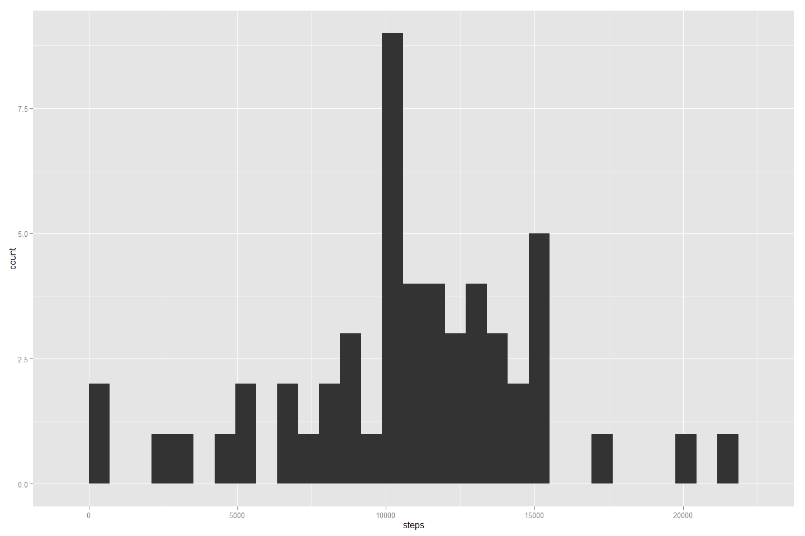
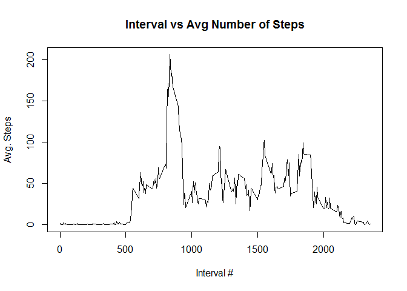
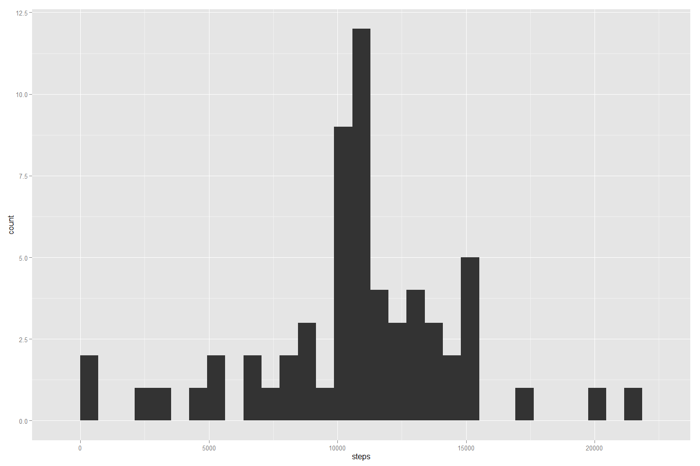
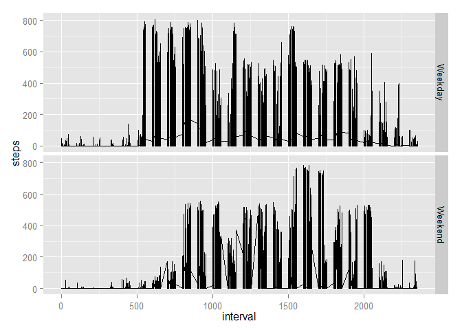

# Reproducible Research: Peer Assessment 1

## Introduction

It is now possible to collect a large amount of data about personal movement using activity monitoring devices such as a Fitbit, Nike Fuelband, or Jawbone Up. These type of devices are part of the "quantified self" movement -- a group of enthusiasts who take measurements about themselves regularly to improve their health, to find patterns in their behavior, or because they are tech geeks. But these data remain under-utilized both because the raw data are hard to obtain and there is a lack of statistical methods and software for processing and interpreting the data.

This assignment makes use of data from a personal activity monitoring device. This device collects data at 5 minute intervals through out the day. The data consists of two months of data from an anonymous individual collected during the months of October and November, 2012 and include the number of steps taken in 5 minute intervals each day.

## Data

The data for this assignment can be downloaded from the course web site:

Dataset: [Activity monitoring data](https://d396qusza40orc.cloudfront.net/repdata%2Fdata%2Factivity.zip)
The variables included in this dataset are:

steps: Number of steps taking in a 5-minute interval (missing values are coded as NA)

date: The date on which the measurement was taken in YYYY-MM-DD format

interval: Identifier for the 5-minute interval in which measurement was taken

The dataset is stored in a comma-separated-value (CSV) file and there are a total of 17,568 observations in this dataset.

## Loading and preprocessing the data


```r
## Load ggplot2 library
library(ggplot2)
## Load scales library
library(scales)

options(scipen=999)

## Load the data (i.e. read.csv())
data <- read.csv("activity.csv")

# Sum the total number of steps per day
total <- aggregate(data$steps, list(date=data$date), sum)
total$steps <- total$x
total$date <- as.Date(total$date)

# Calculate the average number of steps per day
avg.steps <- round( mean(total$x, na.rm = TRUE), 0)

# Calculate the median number of steps per day
median.steps <- round( median(total$x, na.rm=TRUE), 0)

# Make a histogram of the total number of steps taken each day
qplot(steps, data=total) 
```

```
## stat_bin: binwidth defaulted to range/30. Use 'binwidth = x' to adjust this.
```

 

## What is the mean total number of steps taken per day?

The mean number of steps taken per day With missing values is: 10766.

The median number of steps taken per day with missing values is: 10765.

## What is the average daily activity pattern?


```r
## Average number of steps per interval
avg.interval <- aggregate(x=data$steps, list(y = data$interval), mean, na.rm=TRUE )

## Time series plot of interval vs avg number of steps
plot(avg.interval$y, avg.interval$x, type="l", xlab="Interval #", ylab="Avg. Steps", main="Interval vs Avg Number of Steps")
```

 

The 5-minute interval that contains the maximum number of steps is: 104

## Imputing missing values


```r
## Calculate number of rows with missing values
num.rows.missing <- nrow( data [is.na(data$steps),] )

## Calculate missing days/intervals
daysNA <- nrow(array(unique(data$date[is.na(data$steps)])))

## Create a new data set
## Copy the data frame
newdata <- data

## Imputing values strategy: assign the missing interval value the mean of the interval of all days
## Assign mean steps for each missing interval using means calculated above
newdata[is.na(newdata$steps)==TRUE,1] <- avg.interval$x

# Sum the total number of steps per day on the new dataset
total.new <- aggregate(newdata$steps, list(date=newdata$date), sum)
total.new$steps <- total.new$x
total.new$date <- as.Date(total.new$date)

# Calculate the average number of steps per day
avg.new.steps <- round( mean(total.new$steps), digits=0)

# Calculate the median number of steps per day
med.new.steps <- round( median(total.new$steps), digits=0)

# Create a histogram of the number of steps per day
qplot(steps, data=total.new) 
```

```
## stat_bin: binwidth defaulted to range/30. Use 'binwidth = x' to adjust this.
```

 

Total number of rows missing: 2304

Total numnber of days missing: 8

The mean number of steps taken per day Without missing values is: 10766.

The median number of steps taken per day without missing values is: 10766.

There is no impact to the mean or the median of steps when populating the missing values in the dataset.

## Are there differences in activity patterns between weekdays and weekends?


```r
## Setup a new factor and classify by Weekday and Weekend
newdata$day <- factor(weekdays(as.Date(newdata$date)))
levels(newdata$day)[1:2] <- "Weekday"
levels(newdata$day)[4:6] <- "Weekday"
levels(newdata$day)[2:3] <- "Weekend"

# Create a time series panel of two plots (weekdays and weekends)
p4 <- qplot(interval, steps, data=newdata, geom="line", facets=day~.)

p4
```

 
