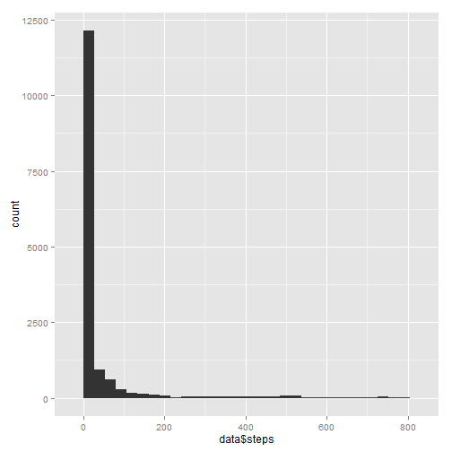
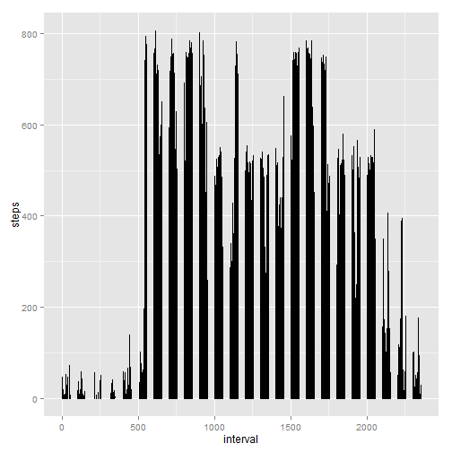
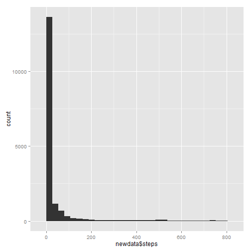
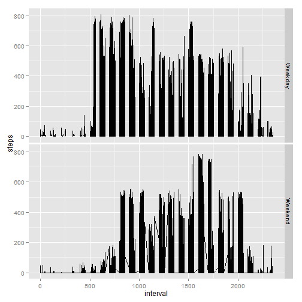

## Loading and preprocessing the dat

```r
library(ggplot2)
data <- read.csv("activity.csv")
```

## What is mean total number of steps taken per day?

```r
qplot(data$steps)
```

```
## stat_bin: binwidth defaulted to range/30. Use 'binwidth = x' to adjust this.
```

 

```r
stepsmean <- mean(data$steps, na.rm=TRUE)
stepsmedian <- median(data$steps, na.rm=TRUE)
```

The mean number of steps taken per day is: 37.3826.

The median number of steps taken per day is: 0.


## What is the average daily activity pattern?


```r
avginterval <- aggregate(steps~interval, data=data, mean, na.rm=TRUE)
maxinterval <- avginterval$interval[avginterval$steps==max(avginterval$steps)]
qplot(interval, steps, data=newdata, geom="line")
```

```
## Warning: Removed 1 rows containing missing values (geom_path).
```

 

## Imputing missing values

```r
steps.na <- nrow(data[is.na(data$steps),])
## Create new dataset
newdata <- data
## Create index list of NA steps
na.steps.list <- which(is.na(newdata$steps)==TRUE)
## Replace NA elements with average steps from previous avginterval values
newdata$steps[na.steps.list] <- replace(newdata$steps, na.steps.list, avginterval$steps[avginterval$interval==newdata$interval])
```

```
## Warning: number of items to replace is not a multiple of replacement length
## Warning: number of items to replace is not a multiple of replacement length
```

```r
## Create histogram
qplot(newdata$steps)
```

```
## stat_bin: binwidth defaulted to range/30. Use 'binwidth = x' to adjust this.
```

 

```r
## Measure new mean
newstepsmean <- mean(newdata$steps)
## Measure new median
newstepsmedian <- median(newdata$steps)
```

The mean number of steps taken per day Without missing values is: NA.

The median number of steps taken per day without missing values is: NA.

## Are there differences in activity patterns between weekdays and weekends?

```r
## Setup a new factor and classify by Weekday and Weekend
newdata$day <- factor(weekdays(as.Date(newdata$date)))
levels(newdata$day)[1:2] <- "Weekday"
levels(newdata$day)[4:6] <- "Weekday"
levels(newdata$day)[2:3] <- "Weekend"
qplot(interval, steps, data=newdata, geom="line", facets=day~.)
```

```
## Warning: Removed 1 rows containing missing values (geom_path).
```

 


